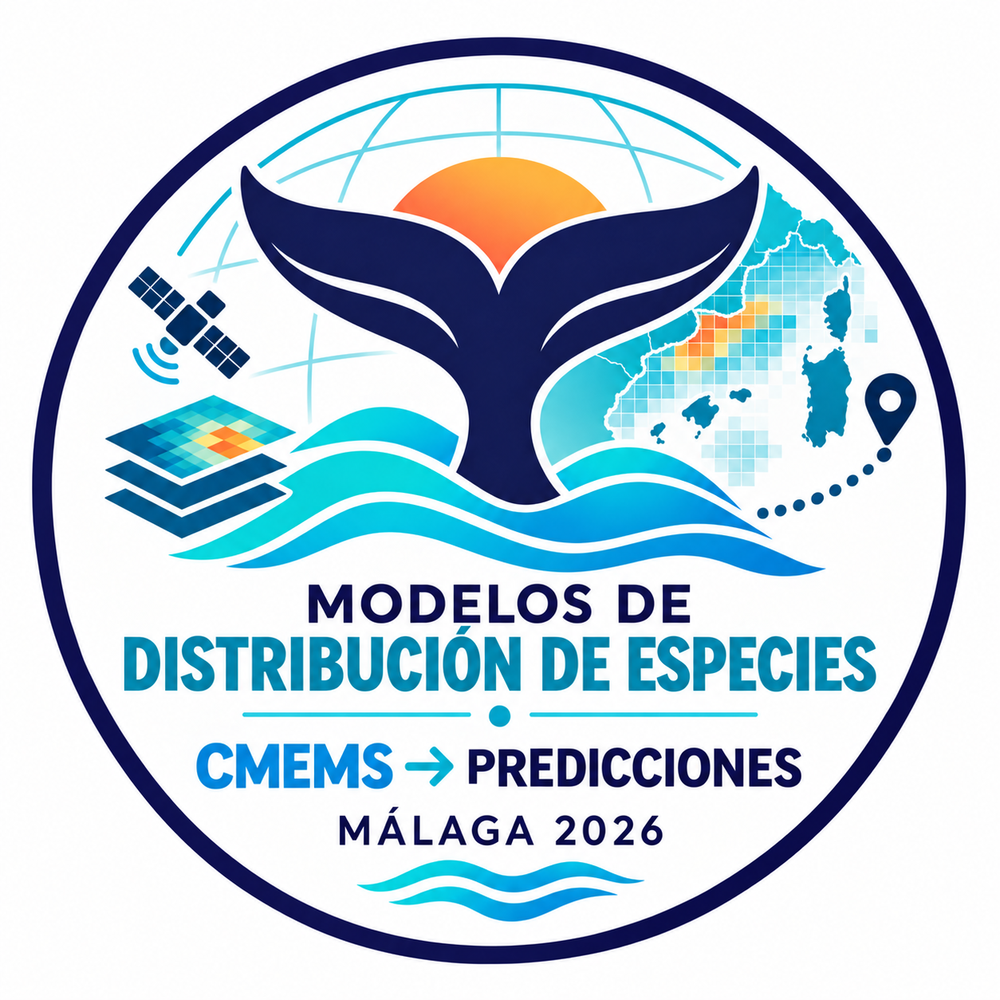

# Modelos de distribución de especies de principio a fin: CMEMS → predicciones (Málaga, 2026)

Este repositorio contiene todo el material necesario para ejecutar un flujo de trabajo completo de Modelos de Distribución de Especies (SDM), desde datos brutos de seguimiento hasta predicciones de idoneidad de hábitat.

<p align="center">
  
</p>

El taller guía a las personas participantes a través de un flujo de trabajo completo:

- procesamiento de datos de seguimiento
- preparación de datos ambientales
- construcción de un conjunto de datos de presencia–ausencia
- ajuste de modelos mediante aprendizaje automático
- predicción espacial y temporal

## Primeros pasos

### 1. Clonar el repositorio

```bash
git clone git@github.com:jazelouled/ModelosDistribucionEspecies_CMEMS_Malaga2026.git
cd ModelosDistribucionEspecies_CMEMS_Malaga2026
```

---

### 2. Preparar los datos de entrada

Algunos archivos de entrada de gran tamaño no están almacenados en el repositorio.

#### Batimetría

Descarga el archivo desde:

https://www.dropbox.com/scl/fi/e90xlk0ousn83qkpuwgoh/bathymetry_wmed.tif?rlkey=6dlp2qgayjvbg4hipn22xuo1n&dl=0

Colócalo en:

```
00inputOutput/00input/00rawData/00enviro/00StaticLayers/
```

#### Datos de seguimiento

Descarga el archivo desde:

https://www.dropbox.com/scl/fi/lgr1izxp7ls9jn6waqxen/simulated_tracking_final.csv?rlkey=1hc94drsmj7e8zf04nm4jd6r6&dl=0

Colócalo en:

```
00inputOutput/00input/00rawData/01tracking/
```

#### Datos ambientales

Si la descarga directa desde Copernicus falla, puedes utilizar este enlace, que contiene los mismos datos ambientales:

https://www.dropbox.com/scl/fo/m6f6znub911rg6dixxnzm/AMOo3HL2sxs23Zm6g5YjNEA?rlkey=towzqx8s5o90amo2w2f3l9dev&dl=0

Coloca los archivos en:

```
00inputOutput/00input/00rawData/00enviro/01CMEMS
```

#### Datos del SSM

El script del modelo de espacio de estados (SSM) es computacionalmente exigente y puede que tu ordenador no consiga ejecutarlo. Para poder continuar con los pasos posteriores, descarga esta carpeta:

https://www.dropbox.com/scl/fo/yk7u4gmf0hf8unbao4v5b/AJRMJD9pZlprMgBT0YbDtQY?rlkey=maai7eo35mv8t2pl7cbjpgocb&dl=0

Colócala en:

```
00inputOutput/00input/01processedData/01tracking/04L2_ssm_behaviour
```

La estructura esperada es:

```
00inputOutput/
└── 00input/
    └── 00rawData/
        ├── 00enviro/
        │   └── 00StaticLayers/
        │       └── bathymetry_wmed.tif
        │
        └── 01tracking/
            ├── simulated_tracking_final.csv
            └── 00auxiliaryFiles/
                ├── bbox_env.txt
                └── tracking_dates.txt
```

---

## Estructura del proyecto

```
ModelosDistribucionEspecies_CMEMS_Malaga2026/
│
├── README.md
│
├── 00inputOutput/
│   ├── 00input/
│   │   ├── 00rawData/
│   │   │   ├── 00enviro/
│   │   │   │   ├── 00StaticLayers/
│   │   │   │   ├── 01CMEMS/
│   │   │   │   └── oceanmask.tif
│   │   │   │
│   │   │   └── 01tracking/
│   │   │       └── 00auxiliaryFiles/
│   │   │
│   │   └── 01processedData/
│   │       ├── 00enviro/
│   │       │   ├── 02presentStacks/
│   │       │   └── 03futureStacks/
│   │       │
│   │       └── 01tracking/
│   │           ├── 00L0_data/
│   │           ├── 02L1_douglas/
│   │           ├── 03L1_spaceTimeSplit/
│   │           ├── 04L2_ssm_behaviour/
│   │           └── 06PresAbs_grid/
│   │
│   └── 01output/
│       ├── 00figures/
│       ├── 01rasters/
│       ├── 02models/
│       └── 03tables/
│
├── 01scripts/
│   ├── 00_main.R
│   │
│   ├── 00enviro/
│   │   ├── 00_oceanMask.R
│   │   ├── 01_downloadCMEMS.R
│   │   ├── 01_downloadCMEMS.sh
│   │   ├── 03_prepareStaticLayers.R
│   │   ├── 04_prepareCMEMS.R
│   │   └── 06_buildPresentStack.R
│   │
│   ├── 01tracking/
│   │   ├── 00_L0_read_and_standardize_Balaenoptera_artificialis_tracking.R
│   │   ├── 02_L1_douglas_speed_filter_Balaenoptera_artificialis_from_L0.R
│   │   ├── 03_L1_spacetime_split_Balaenoptera_artificialis.R
│   │   ├── 04_L2_ssm_by_segment_Balaenoptera_artificialis_QC_routePath.R
│   │   ├── 05_simulations_tracks_Balaenoptera_artificialis.R
│   │   └── 06_presAbs_grid_balancing_Balaenoptera_artificialis.R
│   │
│   └── 02habitatModel/
│       ├── 00_exploratoryDataAnalysis_Balaenoptera_artificialis
│       ├── 01_fitRF_Balaenoptera_artificialis
│       ├── 02_predictDaily_and_MeanSD_Balaenoptera_artificialis
│       └── 99sessionInfo.R
```

---

## Resumen del flujo de trabajo

### Procesamiento de datos de seguimiento

```
00_L0_read_and_standardize_Balaenoptera_artificialis_tracking.R
02_L1_douglas_speed_filter_Balaenoptera_artificialis_from_L0.R
03_L1_spacetime_split_Balaenoptera_artificialis.R
04_L2_ssm_by_segment_Balaenoptera_artificialis_QC_routePath.R
05_simulations_tracks_Balaenoptera_artificialis.R
06_presAbs_grid_balancing_Balaenoptera_artificialis.R
```

Transforma los datos de seguimiento brutos en un conjunto de datos estructurado de presencia–ausencia.

---

### Procesamiento de datos ambientales

```
00_oceanMask.R
01_downloadCMEMS.R / 01_downloadCMEMS.sh
03_prepareStaticLayers.R
04_prepareCMEMS.R
06_buildPresentStack.R
```

Construye predictores ambientales alineados en el espacio y el tiempo.

---

### Modelización de hábitat

```
00_exploratoryDataAnalysis_Balaenoptera_artificialis.R
01_fitRF_Balaenoptera_artificialis.R
02_predictDaily_and_MeanSD_Balaenoptera_artificialis.R
99sessionInfo.R
```

Ajusta los modelos y genera predicciones espaciales.

---

## Ejecutar el flujo de trabajo completo

```r
source("01scripts/00_main.R")
```

---

## Requisitos

- R (≥ 4.0)
- Paquetes: terra, sf, tidyverse, aniMotum, caret, randomForest, ranger
- Git
- Copernicus Marine Toolbox (`copernicusmarine`)

---

## Notas

- El flujo de trabajo es modular y reproducible.
- Los datos de entrada, el procesamiento y los resultados están claramente separados.
- Los resultados de los modelos dependen en gran medida de la calidad de los datos de entrada.
- El código está diseñado para la docencia: prima la claridad frente a la optimización.